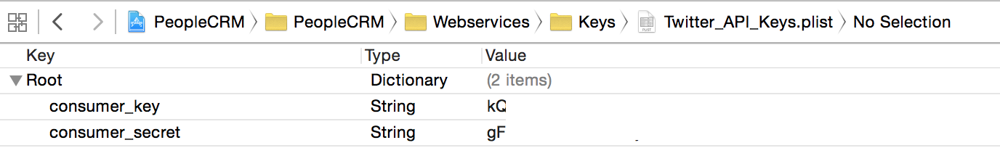

#Demo App

This App was built as a demo for a [talk on Functional Reactive Programming on iOS](https://github.com/Ben-G/Talk-FunctionalReactiveProgramming-iOS).

##Running this App

If you want to run this app you will need to create an app on [apps.twitter.com](https://apps.twitter.com) since this application requires to authenticate with Twitter.

Once you have created an app you need to create a `.plist` file called `Twitter_API_Keys.plist` and add it to the project.

Finally, you need to fill the plist with the `consumer_key` and `consumer_secret` provided by twitter:

